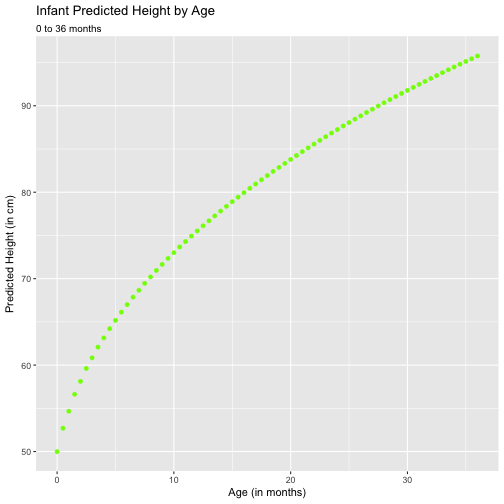

Child Height Predictor App
========================================================
author: Joseph Scheidt
date: April 30, 2017
autosize: true

Summary
========================================================

Most parents are interested in how tall their children will grow up to be, given their current age and height. This app is a simple prediction mechanism, based on data on US children from the Centers for Disease Control, that will show how a given child's height is likely to change as they age, and will give a prediction as to how tall an infant will be at 3 years of age, or how tall a child will be at 20 years of age.

Input
========================================================

This app has two tabs: one for the infant height predictor (0 to 36 months) and one for the child height predictor (2 to 20 years). The app then takes several inputs:

- Gender (Male or Female)
- Height (can be in cm or inches)
- Age (when height was recorded)

Calculations
========================================================

After submitting the input, the app calculates the z score for that input, using CDC data of mean and sd heights at each half-month age, to plot a predicted aging curve for the child's height, and calculate the predicted height at 36 months or 20 years. The code for this calculation is shown below:


```r
converter <- ifelse(input$unit1=="cm", 1, 2.54)
                      
zScore <- (as.numeric(input$height1) * converter - 
        infTable[infTable$sex==input$sex1 & 
                  infTable$age==as.numeric(input$age1),]$mean)/
        infTable[infTable$sex==input$sex1 & 
                  infTable$age==as.numeric(input$age1),]$sd
```

Output
========================================================

A sample plot of a male infant with average height is shown below:



Thanks!
